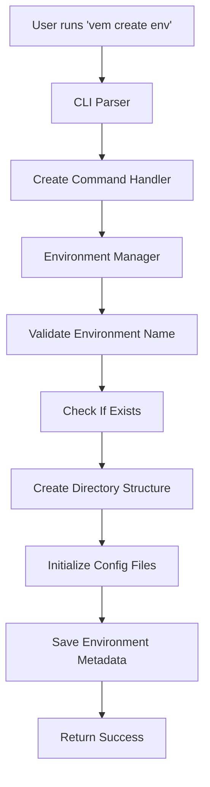
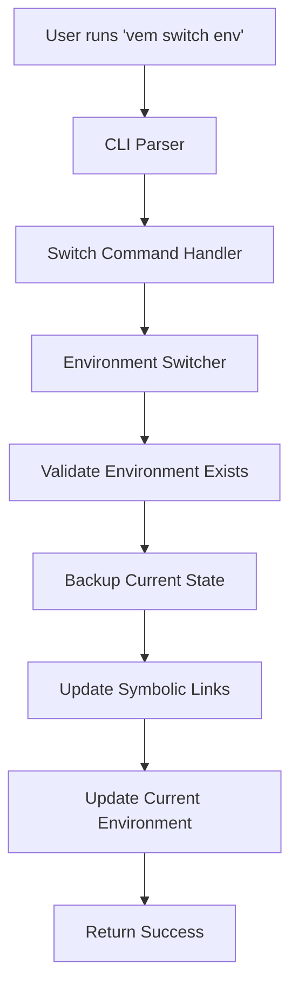

# Architecture

VEM follows a clean, modular architecture designed for maintainability, testability, and extensibility. This document outlines the system design and explains how the different components work together.

## High-Level Architecture

```
┌─────────────────┐    ┌─────────────────┐    ┌─────────────────┐
│   CLI Layer     │    │  Business Logic │    │  Data Layer     │
│      (ctl)      │◄──►│     (usc)       │◄──►│     (rep)       │
└─────────────────┘    └─────────────────┘    └─────────────────┘
         │                       │                       │
         ▼                       ▼                       ▼
┌─────────────────┐    ┌─────────────────┐    ┌─────────────────┐
│ Configuration   │    │    Entities     │    │  File System    │
│     (cnf)       │    │     (ent)       │    │                 │
└─────────────────┘    └─────────────────┘    └─────────────────┘
```

## Layer Responsibilities

### Control Layer (`ctl/`)

The control layer handles user interaction and command parsing.

**Responsibilities:**
- Command-line argument parsing
- User input validation
- Output formatting
- Error message display
- Shell integration

**Key Components:**
- `cli.rs` - Main CLI interface using clap
- `commands/` - Individual command implementations
- `output.rs` - Output formatting and display

### Use Case Layer (`usc/`)

The use case layer contains the application's business logic.

**Responsibilities:**
- Environment management workflows
- Business rule enforcement
- Coordination between repositories
- Transaction management

**Key Components:**
- `environment_manager.rs` - Core environment operations
- `switcher.rs` - Environment switching logic
- `validator.rs` - Business rule validation

### Repository Layer (`rep/`)

The repository layer handles data persistence and retrieval.

**Responsibilities:**
- File system operations
- Data serialization/deserialization
- Storage abstractions
- Backup and recovery

**Key Components:**
- `environment_repository.rs` - Environment CRUD operations
- `config_repository.rs` - Configuration management
- `file_system.rs` - File system abstractions

### Entity Layer (`ent/`)

The entity layer defines the core data structures and domain models.

**Responsibilities:**
- Domain model definitions
- Data validation
- Business invariants
- Type safety

**Key Components:**
- `environment.rs` - Environment domain model
- `config.rs` - Configuration structures
- `error.rs` - Error types and handling

### Configuration Layer (`cnf/`)

The configuration layer manages application settings and environment configurations.

**Responsibilities:**
- Application configuration
- User preferences
- Default settings
- Configuration validation

**Key Components:**
- `app_config.rs` - Application-wide settings
- `user_config.rs` - User-specific preferences
- `defaults.rs` - Default configurations

## Data Flow

### Environment Creation Flow



### Environment Switching Flow



## File System Structure

VEM manages environments in a structured directory layout:

```
~/.vem/
├── config.json                    # Global VEM configuration
├── current -> environments/dev     # Symlink to current environment
├── environments/                   # All environment definitions
│   ├── development/
│   │   ├── .vimrc                 # Environment-specific vimrc
│   │   ├── .vim/                  # Environment-specific vim directory
│   │   └── meta.json              # Environment metadata
│   ├── writing/
│   │   ├── .vimrc
│   │   ├── .vim/
│   │   └── meta.json
│   └── ...
└── backups/                       # Automatic backups
    ├── 2024-01-01_backup.tar.gz
    └── ...
```

## Error Handling Strategy

VEM uses a layered error handling approach:

1. **Domain Errors**: Business logic violations (e.g., environment not found)
2. **System Errors**: File system, permissions, etc.
3. **User Errors**: Invalid input, malformed commands
4. **Internal Errors**: Programming errors, panics

```rust
pub enum VemError {
    EnvironmentNotFound(String),
    EnvironmentAlreadyExists(String),
    InvalidEnvironmentName(String),
    FileSystemError(io::Error),
    ConfigurationError(String),
    PermissionDenied(String),
}
```

## Testing Strategy

### Unit Tests
- Individual component testing
- Mock external dependencies
- Test business logic in isolation

### Integration Tests
- End-to-end command testing
- File system interaction testing
- Configuration management testing

### Property-Based Tests
- Environment name validation
- File system state consistency
- Command idempotency

## Concurrency Model

VEM is designed to handle concurrent operations safely:

- **File Locking**: Prevents concurrent modifications
- **Atomic Operations**: Ensure consistency during switches
- **Transaction Logs**: Enable rollback on failures

## Extension Points

The architecture supports future extensions:

- **Plugin System**: Via the use case layer
- **Multiple Backends**: Via repository abstractions
- **Custom Commands**: Via the CLI layer
- **Configuration Formats**: Via serialization traits

## Performance Considerations

- **Lazy Loading**: Environments loaded on demand
- **Caching**: Frequently accessed data cached
- **Minimal I/O**: Optimize file system operations
- **Parallel Operations**: Where safe and beneficial

This architecture ensures VEM remains maintainable and extensible while providing reliable Vim environment management.